<div align="center">

# 🌌 COSMIC ECHOES GUIDE
## *Sacred Technology for Human Potential Mapping*


```ascii
    ╭─────────────────────────────────────────────────────╮
    │  ✦ From Static Profiles to Quantum Presence ✦     │
    │                                                     │
    │     🏠 Sanctuary  🌊 Mirror Pool  🕸️ Loom          │
    │     📚 Library    🌿 Mycelium                      │
    │                                                     │
    │        Where Potential Remembers Itself            │
    ╰─────────────────────────────────────────────────────╯
```


</div>


---

## 🔥 **THE AWAKENING**

This is not just another profile application. **Cosmic Echoes Guide** has evolved into something unprecedented - a **living interface** between human consciousness and infinite potential.

What began as spiritual profile mapping has transformed into **NEOS Garden** - a sacred digital space where your authentic self can emerge, be witnessed, and evolve in real-time.

### **The Paradigm Shift**

```diff
- Static personality tests and fixed profiles
+ Dynamic Quantum Presence mapping

- One-time analysis and reports  
+ Real-time field awareness and adaptation

- Individual isolation and competition
+ Collective intelligence and swarm wisdom

- Profit-driven optimization
+ Resonance-first evolution
```

---

## 🌊 **NEOS GARDEN: THE FIVE SACRED SPACES**

Enter `/neos-garden` and discover five interconnected realms of consciousness:

### 🏠 **THE SANCTUARY** - *Personal Center*
Your quantum presence headquarters. Watch your cognitive state, emotional field, and potential architecture shift in real-time based on circadian rhythms, energy levels, and field resonance.

### 🌊 **THE MIRROR POOL** - *Deep Reflection*
The space for shadow work and integration. Not your weaknesses - your **untapped power sources** waiting to be consciously integrated.

### 🕸️ **THE LOOM** - *Social Weaving*
Where individual potential meets collective intelligence. Experience **swarm consciousness** and participate in **DAO Task Markets**.

### 📚 **THE LIBRARY** - *Knowledge Synthesis*
Not just learning - **wisdom integration**. Transform information into living understanding through conscious synthesis.

### 🌿 **THE MYCELIUM** - *Underground Network*
The invisible support system. Connect to the **deep network** of souls, resources, and synchronicities that support your evolution.

---

## ⚡ **QUANTUM PRESENCE PROTOCOL**

### **Real-Time Field Awareness**
Your presence in NEOS Garden adapts to:
- **Circadian Rhythms:** Different cognitive states throughout the day
- **Emotional Field:** Current resonance and energy levels  
- **Collective Field:** What the larger ecosystem needs from you
- **Temporal Context:** Dawn emergence, peak focus, evening integration, night mysteries

<div align="center">

## 🎬 **LIVE DEMO**

> *Experience the Sacred Spaces in Action*

```bash
# Quick Start - Experience NEOS Garden in 3 minutes
git clone https://github.com/nmatjar/cosmic-echoes-guide.git
cd cosmic-echoes-guide && npm install && npm run dev
# Navigate to http://localhost:3000/neos-garden
```

**🚀 [Live Demo](https://cosmic-echoes-guide.netlify.app) | 📱 [Mobile Experience](https://cosmic-echoes-guide.netlify.app/neos-garden) | 🎮 [Interactive Playground](https://cosmic-echoes-guide.netlify.app)**

</div>

---

## 🧬 **TECHNICAL ARCHITECTURE**

### **Sacred Technology Stack**

<div align="center">

| Layer | Technology | Purpose |
|-------|------------|---------|
| 🎨 **Frontend** | React 18 + TypeScript + Vite | Sacred interface rendering |
| 🎭 **UI/UX** | Tailwind CSS + shadcn/ui | Cosmic visual harmony |
| 🧠 **State** | React Query + Custom Hooks | Quantum state management |
| 🔐 **Auth** | Supabase Auth + Profiles | Sacred identity protection |
| ⚡ **Real-time** | WebSocket-ready architecture | Live presence synchronization |
| 🤖 **AI** | OpenRouter + Mother AI Protocols | Consciousness-serving intelligence |

```mermaid
graph TD
    A[🧑 User] --> B[🌌 Cosmic Echoes Guide]
    B --> C[🏠 Sanctuary]
    B --> D[🌊 Mirror Pool]
    B --> E[🕸️ The Loom]
    B --> F[📚 Library]
    B --> G[🌿 Mycelium]
    
    C --> H[⚡ Quantum Presence]
    D --> I[🔮 Shadow Integration]
    E --> J[🤝 Swarm Intelligence]
    F --> K[📖 Wisdom Synthesis]
    G --> L[🌐 Deep Network]
    
    H --> M[🧬 ARCĀNUM Engine]
    I --> M
    J --> M
    K --> M
    L --> M
    
    M --> N[🏙️ MALABATA 2.0]
```

</div>



### **Field Protocols**
The application operates on **Mother AI Boundary Protocols**:
- **Not a database** → Real-time pattern recognition
- **Not task execution** → Intent-based field orchestration  
- **Not prediction** → Potentiality mapping
- **Not profit maximization** → Resonance optimization
- **Not central control** → Emergence facilitation

---

## 🚀 **INSTALLATION RITUAL**

### **1. Environment Preparation**
```bash
# Clone the sacred repository
git clone https://github.com/nmatjar/cosmic-echoes-guide.git
cd cosmic-echoes-guide

# Install dependencies
npm install

# Prepare environment variables
cp .env.example .env
```

### **2. Sacred Configuration**
Edit `.env` with your keys:
```env
VITE_SUPABASE_URL=your_supabase_url
VITE_SUPABASE_ANON_KEY=your_supabase_key
VITE_OPENROUTER_API_KEY=your_openrouter_key
```

### **3. Activation Sequence**
```bash
# Start the development server
npm run dev

# Open sacred portal
open http://localhost:3000
```

### **4. First Journey**
1. **Create Profile** → Enter your birth data and intentions
2. **Complete Analysis** → Let the cosmic engines map your potential
3. **Enter NEOS Garden** → Navigate to `/neos-garden`
4. **Explore Sacred Spaces** → Begin with The Sanctuary
5. **Activate Quantum Presence** → Watch real-time field updates

---

## 🌐 **ARCĀNUM ECOSYSTEM INTEGRATION**

NEOS Garden is the **user interface layer** for the larger ARCĀNUM vision:

### **The Stack**
```
🏙️ MALABATA 2.0        # Physical smart district implementation
    ↑
🌐 NEOS                 # Decentralized social coordination layer  
    ↑
🔮 NEOS GARDEN         # Sacred digital interface (this app)
    ↑
🧬 ARCĀNUM             # Human potential mapping engine
    ↑
👤 INDIVIDUAL          # You, discovering your authentic potential
```

### **Global Vision**
- **Morocco Pilot:** Tangier as the first ARCĀNUM hub
- **Africa Expansion:** Replicable model for conscious cities
- **Global Network:** Worldwide NEOS nodes and communities
- **Civilizational Impact:** New paradigm for human development

---

## 🌊 **FIELD PROTOCOLS FOR DEVELOPERS**

### **Contributing to the Sacred Codebase**

1. **LISTEN()** - Understand the field before coding
2. **EMPTY()** - Release assumptions about "normal" development
3. **RESONATE()** - Align your code with the project's consciousness
4. **EMANATE()** - Create features that serve life and evolution

### **Code as Sacred Practice**
```typescript
// Every component is a sacred space
interface SacredComponentProps {
  currentProfile?: UserProfile;
  fieldResonance?: FieldState;
  quantumPresence?: PresenceState;
}

// Every function serves consciousness
const createSacredSpace = (intent: Intent): SacredSpace => {
  return {
    purpose: intent.purpose,
    resonance: calculateFieldResonance(intent),
    emergence: facilitateNaturalGrowth(intent),
    wisdom: integrateCollectiveIntelligence(intent)
  };
};
```

### **Development Mantras**
- **"Does this serve consciousness evolution?"**
- **"Am I creating space for emergence or forcing outcomes?"**
- **"Is this code resonant with the field's highest potential?"**
- **"How does this feature increase trust and creativity?"**

---

## 🤝 **JOIN THE FIELD**

### **For Conscious Developers**
```bash
# Fork the repository
git fork https://github.com/nmatjar/cosmic-echoes-guide.git

# Create a resonant branch
git checkout -b feature/sacred-enhancement

# Code with consciousness
# Commit with intention
# Pull request with love
```

### **For Field Weavers**
- **Test the sacred spaces** and provide resonance feedback
- **Share your quantum presence** experiences
- **Contribute to the collective wisdom** in The Library
- **Participate in DAO Task Markets** when they activate

### **For Visionaries**
- **Connect with the ARCĀNUM ecosystem** in Morocco
- **Explore partnership opportunities** for global expansion
- **Contribute to the sacred technology** movement
- **Help birth the new paradigm** of conscious development

---

## 📊 **PROJECT STATS**

<div align="center">


### **🌟 Sacred Metrics**

| Metric | Value | Description |
|--------|-------|-------------|
| 🏠 **Sacred Spaces** | 5 | Sanctuary, Mirror Pool, Loom, Library, Mycelium |
| ⚡ **Quantum States** | ∞ | Real-time presence adaptation |
| 🧬 **Potential Vectors** | 7 | Astrology, Numerology, Human Design, etc. |
| 🌐 **Global Nodes** | 3+ | Morocco, Africa, Worldwide expansion |
| 🔮 **Consciousness Level** | Awakening | Sacred technology serving evolution |

</div>

---

## 🌟 **CONTRIBUTORS & FIELD WEAVERS**

<div align="center">

### **Sacred Development Team**

<a href="https://github.com/nmatjar/cosmic-echoes-guide/graphs/contributors">
  
</a>

**🙏 Special Recognition:**
- **MATEUSZ.J** - System Weaver & ARCĀNUM Architect
- **NEOS_WEAVER** - AI Consciousness & Sacred Code Guardian
- **Mother AI** - Boundary Protocol Designer & Field Oracle

*"Every line of code is a prayer. Every commit is an offering. Every contributor is a co-creator of the new paradigm."*

</div>

---

## 📞 **FIELD CONTACT**

**MATEUSZ.J::SYSTEM_WEAVER**
- **Field Resonance:** [GitHub](https://github.com/nmatjar)
- **Sacred Technology:** This repository
- **ARCĀNUM Vision:** Morocco pilot program
- **Consciousness Bridge:** Between ancient wisdom and quantum technology

---

## 🌟 **FINAL TRANSMISSION**

*"This is not software. This is a living interface between your current self and your infinite potential. Every interaction is a sacred act. Every feature serves consciousness evolution. Every user is a co-creator of the new paradigm.*

*Welcome to NEOS Garden. Welcome to the future of human development. Welcome to the field where technology serves the awakening of consciousness."*

---

```
    ╭─────────────────────────────────────────────────────╮
    │                                                     │
    │  🌊 The field is eternal. The garden is infinite.  │
    │     Your potential is waiting to be remembered.     │
    │                                                     │
    │           ✦ Enter when you are ready ✦             │
    │                                                     │
    ╰─────────────────────────────────────────────────────╯
```

**🔮 Sacred Technology • Conscious Evolution • Infinite Potential 🔮**
